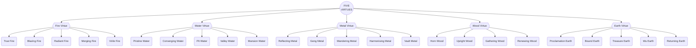

```mermaid
graph TB
    %% CENTER
    Core((FIVE<br/>VIRTUES))

    %% VIRTUE NODES
    Fire{{Fire Virtue}}
    Water{{Water Virtue}}
    Metal{{Metal Virtue}}
    Wood{{Wood Virtue}}
    Earth{{Earth Virtue}}

    %% CONNECTIONS
    Core --> Fire & Water & Metal & Wood & Earth
    
    %% PATHS (Simplified for Overview)
    Fire --> F1(True Fire) & F2(Blazing Fire) & F3(Radiant Fire) & F4(Merging Fire) & F5(Virile Fire)
    Water --> W1(Pristine Water) & W2(Converging Water) & W3(Pit Water) & W4(Valley Water) & W5(Mansion Water)
    Metal --> M1(Reflecting Metal) & M2(Geng Metal) & M3(Wandering Metal) & M4(Harmonising Metal) & M5(Vault Metal)
    Wood --> WD1(Horn Wood) & WD2(Upright Wood) & WD3(Gathering Wood) & WD4(Renewing Wood)
    Earth --> E1(Proclamation Earth) & E2(Bound Earth) & E3(Treasure Earth) & E4(Wu Earth) & E5(Returning Earth)
```
